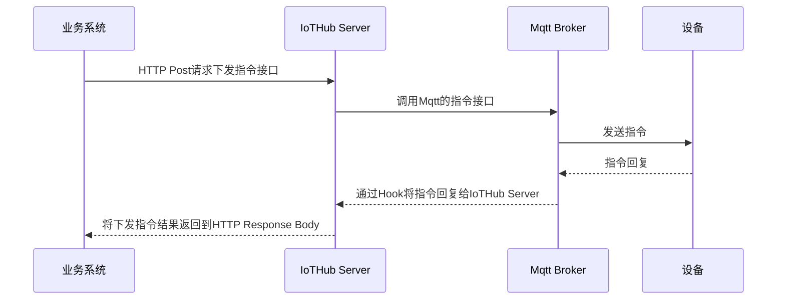

## 下行数据处理
下行数据一般有两种：第一种是需要同步的数据，比如平台需要把训练好的模型部署到前端的摄像头上，这样平台下发给设备的消息中就包含了模型数据的信息；第二种是指令，平台下发给设备，要求设备完成某种操作，比如共享单车的服务端下发给单车开锁的指令。

这两种下行数据统称为指令，因为第一种数据也可以当作是要求设备完成“同步数据”这个操作的指令。大多数情况下，设备在收到指令后都应该向业务系统回复指令执行的结果（注意，不是回复指令已收到，因为使用QoS>1 的消息在 `MQTT` 协议层面就已经保证设备一定能收到指令。），比如文件有没有下载完毕、继电器有没有打开等。是否回复以及如何回复应该由业务逻辑决定，这个是业务系统和设备之间的约定，IotHub只负责将业务系统下发的指令发送到设备，同时将设备对指令的回复再传送回业务系统。

### 下行数据格式
- `ProductName`、`DeviceName`：用于标识指令发送给哪个设备。
- `MessageID`：作为消息的唯一标识，用于消息去重，也用于标识指令，设备回复指令时会用到。
- **过期时间**： 有些指令具有时效性，设备不应该执行超过有效时间的指令
- **指令名称**： 用于标识指令的名称


### IotHub指令下发功能
1.  IotHub 可发向设备发送任意指令格式的数据比如字符串和二进制数据
2. 指令可设置过期时间，过期的指令将不会执行（mqtt协议可设置 Publication Expiry Interval  过期时间）
3. IotHub可在设备离线时下发指令，设备上线以后可以接收到离线时IotHub下发的指令(mqtt协议消息可通过持久化实现)
4. 设备可向IotHub回复指令的执行结果


### 指令下发流程

#### 异步回调通知调用者


1. 业务系统调用Server API发送指令。

2. IotHub Server调用MQTT服务的Publish API（RESTful）。

3. MqTT Broker发布消息到设备订阅的主题。

4. DeviceSDK提取出指令的信息并通过Event的方式传递到设备应用代码。

5. 设备应用代码执行完指令要求的操作后，通过Callback（闭包）的方式要求DeviceSDK对指令进行回复。

6. DeviceSDK 发布包含指令回复的消息到Mqtt Broker。

7. Mqtt Broker 通过WebHook将指令回复传递到 IotHub Server。

8. IotHub Serve r将指令回复发送到 RabbitMQ 对应的队列中。

9. 业务系统从Mq的对应队列获得指令的回复。

#### RPC式调用



#####  伪代码实现
Step 1: 业务系统发送HTTP Post请求
```java
RestTemplate restTemplate = new RestTemplate();
String url = "http://iot-hub-server/api/sendCommand";
HttpHeaders headers = new HttpHeaders();
headers.setContentType(MediaType.APPLICATION_JSON);
HttpEntity<String> request = new HttpEntity<>(commandJson, headers);
ResponseEntity<String> response = restTemplate.postForEntity(url, request, String.class);

```

Step 2: IotHub Server接收请求并发送指令到MQ
```java
@RestController
@RequestMapping("/api")
public class CommandController {
    
    @Autowired
    private CommandService commandService;

    @PostMapping("/sendCommand")
    public ResponseEntity<String> sendCommand(@RequestBody CommandRequest commandRequest) {
        try {
            CompletableFuture<String> futureResponse = commandService.sendCommand(commandRequest);
            String deviceResponse = futureResponse.get(30, TimeUnit.SECONDS); // 等待设备回复，超时时间30秒
            return ResponseEntity.ok(deviceResponse);
        } catch (TimeoutException e) {
            return ResponseEntity.status(HttpStatus.REQUEST_TIMEOUT).body("设备无响应");
        } catch (Exception e) {
            return ResponseEntity.status(HttpStatus.INTERNAL_SERVER_ERROR).body("服务器错误");
        }
    }
}

```

Step 3: 将指令发送到MQ
```java
@Service
public class CommandService {

    @Autowired
    private JmsTemplate jmsTemplate;

    @Autowired
    private CommandResponseListener responseListener;

    public CompletableFuture<String> sendCommand(CommandRequest commandRequest) {
        CompletableFuture<String> futureResponse = new CompletableFuture<>();
        String correlationId = UUID.randomUUID().toString();

        responseListener.registerCallback(correlationId, futureResponse);

        jmsTemplate.convertAndSend("deviceCommandQueue", commandRequest, message -> {
            message.setJMSCorrelationID(correlationId);
            return message;
        });

        return futureResponse;
    }
}

```

Step 4: 设备处理指令并发送回复

设备端需要订阅`deviceCommandQueue`队列，处理指令后，将结果发布到`deviceResponseQueue`队列。

Step 5: IotHub Server接收设备回复并返回给业务系统
```java
@Component
public class CommandResponseListener {

    private final Map<String, CompletableFuture<String>> callbackMap = new ConcurrentHashMap<>();

    @JmsListener(destination = "deviceResponseQueue")
    public void receiveMessage(Message message) throws JMSException {
        String correlationId = message.getJMSCorrelationID();
        String response = ((TextMessage) message).getText();

        CompletableFuture<String> futureResponse = callbackMap.remove(correlationId);
        if (futureResponse != null) {
            futureResponse.complete(response);
        }
    }

    public void registerCallback(String correlationId, CompletableFuture<String> futureResponse) {
        callbackMap.put(correlationId, futureResponse);
    }
}

```
## 设备连接状态判断

MQTT协议并没有在协议级别约定如何对Client的在线状态进行管理

-  上线判断：Client在连接成功时向TopicA发送一个消息，表示Client已经上线。
-  离线判断 ：Client在连接时指定LWT（遗嘱消息），Client在离线时向TopicA发送一个Retained消息（保留消息），表示已经离线。
只要订阅TopicA就可以获取Client上线和离线的状态。

### 涂鸦离线规则判断
1. 设备每 60s会向服务端发送一个ping包， 接下来如果42秒内没有收到服务端回复的pong（ping/pong用于测试tcp连接是否断开），设备端会发送rst包（异常关闭连接）直接强制断开tcp连接，显示离线原因为closed。

2. 服务端每个连接75秒检查一次，没有完全依赖ping包做检测，服务端认为只要在心跳周期内收到任意设备上报的数据，该tcp链路即为正常。如果在两次检测周期均没有收到设备端任何数据，服务端认为设备已离线。


## OTA 升级

OTA（Over-the-Air Technology）一般叫作空中下载技术，在物联网应用里，设备一般都是通过OTA技术进行软件升级的，设备应用升级的类型可能会包括设备应用程序、固件、OS等

###  功能设计
#### 1.获取设备版本号
 
设备的软件版本号可能包括设备应用程序、固件、操作系统等版本号。在上行数据处理功能中，IotHub提供了一个设备状态上报功能，在每次设备系统启动时，设备应该通过状态上报功能上报当前的软件版本号

#### 2. 下发升级指令

业务系统可以通过IotHub的Server API获取当前的设备软件版本信息，按照业务需求决定哪些设备需要升级。业务系统还可以通过IotHub提供的接口向设备下发升级指令，OTA升级指令是一个IotHub内部使用的指令，指令数据包括：

- 将要升级的软件版本号；

- 此次升级的类型（应用、固件、OS等，由业务系统和设备约定）；

- 升级包的下载地址；

- 升级包的md5签名；

- 升级包的大小，单位为字节。

如果要传输较大的二进制文件，比如照片、软件升级包等，最好不要放到MQTT协议消息的Payload里面，而是将文件的URL放入Payload中，Client在收到消息以后，再通过URL去下载文件。

在进行OTA升级前，业务系统需要将升级包上传到一个设备可以访问的网络文件存储服务器中，并提供升级包的下载URL；同时需要提供升级包的md5签名，以免因为网络原因导致设备下载到不完整的升级包，进而导致升级错误。

#### 3. 上报升级进度

当设备接收到升级指令后，应该按照次序执行以下操作：

1. 下载升级包；

2. 校验安装包的md5签名；

3. 执行安装/烧写；

4. 向IotHub上报新的软件版本号。如果升级以后要重启设备应用，设备会在应用启动时，自动通过状态上报功能上报自己的软件版本号；如果升级以后不需要重启设备应用，那么设备应用代码应该使用状态上报功能上再报自己的软件版本号。

```json
{
    "type":"firmware",
    "version":"1.1",
    "process":10,
    "desc":"downloading"
}
```

- type：代表此次升级的类型，比如固件、应用等；
- version：代表此次升级的版本；
- progress：当前的升级进度，由于只有在下载升级包时才能够保证设备应用是在运行的，所以progress只记录下载升级包的进度，取值为1～100。在安装升级包时，很多时候设备应用都是处于被关闭的状态，无法上报进度。同时progress也被当作错误码使用：-1代表下载失败，-2代表签名校验识别失败，-3代表安装/烧写失败，-4代表其他错误导致的安装失败。
- desc：当前安装步骤的描述，也可以记录错误信息。

## 设备接入
### MQTT 协议设备接入 (5.0 protocol)

#### MQTT 设备连接参数

- **Mqtt address**： 你的MQTT服务器地址
- **Mqtt port**： 8083
- **Mqtt client id**： 产品秘钥与设备名拼接，格式为 `product_key_deviceName`
- **Mqtt userName**： 设备名（系统唯一编码）
- **Mqtt password**： 使用产品秘钥与 client 组合生成

#### 设备注册
功能实现待定，可以通过系统预注册或设备上报消息来判断设备是否存在。

#### 设备上下线规则判断
- **在线**：设备连接MQTT向topic上报任意消息，系统接收到设备消息判断设备在线。
- **离线**：
  1. 设备取消topic订阅或者断开连接时判断设备离线。
  2. 使用 `MQTT` 遗嘱消息设备离线后通过遗嘱topic下发设备离线状态。
  3. 系统定时扫描设备最后上报时间，如果大于产品保活时间的1.1倍，则判断设备离线。

#### 设备下行数据
##### 保证下行消息服务质量
设备端设置消息持久化时长（clean session）、服务端设置消息质量服务（Qos）防止因网络波动或资源限制导致mqtt连接异常断开，避免设备因网络中断导致反复订阅带来的额外开销、错过离线期间的消息、保证Qos1和Qos2的消息质量不受网络中断的影响。设备端接收到服务端指令判断的指令是否属于过期，如果是过期的消息则不执行指令。

#### 设备主动上报

 设备启动后主动上报设备属性和设备基本配置等信息。


## IotHub状态监控

监控在线设备的数量有多少，IotHub一共发送消息、接收消息数量
